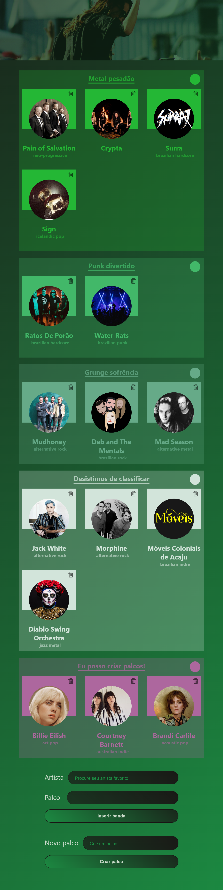

# fEUstival

Crie seu próprio lineup de festival. Escolha bandas e distribua elas pelos palcos.

## Objetivo

O objetivo deste projeto foi criar um site utilizando ReactJS e consumindo a API da Spotify.

## Construído com:

   

## Features

:hammer_and_wrench: Consumo de API utilizando OAuth 2.0;  
:iphone: Paradigma Mobile-First;  
:fountain_pen: Tipografia fluida

## Acesse

<a href="https://marcelluscaio.github.io/fEUstival/">Crie o seu fEUstival</a>.

## Próximos passos

- [X] Permitir que usuario apague bandas inseridas
- [X] Permitir criacao de novos palcos
- [X] Estilização da seta do select
- [X] Permitir que usuario mude a cor
- [X] Estilizacao input color
- [X] Checar responsividade geral
- [X] Trazer opções de bandas para usuario e permitir seleção ao clique

- [ ] Criar categoria de headliner (destaque na estilizacao)
- [ ] Permitir drag and drop para organizar palcos
- [ ] Compartilhar a propria lista no instagram

## Screenshots

